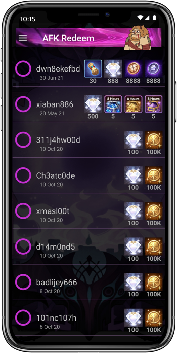

# AFK Redeem

Your AFK Arena redemption codes simplified

 
 

    
     
     
<!--    <a href="https://www.apple.com/app-store/" target="_blank">-->
        
<!--    </a>-->

 
 

    

> more screenshots at [afkredeem.com][afk-redeem]

## Why Share the Sources
The rationale behind sharing the sources is mainly **transparency**.\
Getting notifications for new redemption codes is relatively easy and was done long before this app.
There are other fan-apps notifying about redemption codes, some fan sites facilitate web notifications or email subscription,
there's even an instagram account publishing new codes.\
\
The difference with this app, however, on top of the notification capabilities,
is the usage of Lilith Game's API for redeeming the codes (which honestly makes it A WHOLE LOT EASIER).
The API is not officially supported by Lilith Games but several other community members
have [detected it and put it to good use][reddit-redemption-api].\
In the end the notion of a 3rd party app redeeming codes is somewhat alarming for some users, and perhaps rightfully so.
So the best move for mitigating those concerns was to publish the source code,
and disclose how the app operates for any member of the community to review and confirm there's no monkey business 🙉🙈🙊.\
That being said, in order to protect the app, the [license] for the sources provided in this repo is non-commercial Share-Alike.

## What is Saved & Where
The app doesn't store any information outside the phone.\
Moreover, the app also does not require local storage permissions.\
Everything the app saves locally boils down to simple key value stores provided by either Android / iOS platforms (aka [shared_preferences])\
\
The only user-generated data saved on the phone is the `user ID` entered by the user on first startup.\
Other than that the app saves its internal configuration (redeem api supported versions, codes list, etc.) and trivial UI flags (e.g. disclosure consent, hypogean/celestial mode or whether specific brutus messages were already shown).

## What is sent & Where to
The app uses 2.5 network interfaces.
- Downloading the current list of codes from afkredeem.com upon startup / refresh\
  Receiving also in the same GET: general configuration such as redeemer api version support, brutus messages, etc.\
  \+ a few server-side dialogs UI (plain html), e.g. `about` and redeem api versioning support updates.
  > See [afk_redeem_api.dart]
- Redeeming the codes using Lilith Games [redemption codes REST API][reddit-redemption-api].\
  The app sends the user ID and verifies the verification code, fetches user identity, and consumes any gift codes selected.
  The app uses in-memory cookies to maintain the session with Lilith Games API, however none of the cookies are stored.
  All of the above is sent directly and only to Lilith Games, while none of the byproducts are stored anywhere.
  > See [code_redeemer.dart]
- The app issues push notifications utilizing the [Firebase Cloud Messaging][firebase-messaging] solution (see below).
  This messaging framework uses platform-specific transport service (Android / iOS),
  facilitating notifications while saving the app the hassle of running any battery guzzling background workers.

## Push Notifications
The app uses [Firebase Cloud Messaging][firebase-messaging] solution to receive push notifications sent from the AFK Redeem account.
The app maintainers will issue notifications (currently manually) only in the event of a new redemption codes.
Since both Android & iOS provide means to silence / mute any app's notifications, such configuration setting is not implemented in the app.

## Analytics & Crashlytics
The app uses [Firebase Analytics][firebase-analytics] and [Firebase Crashlytics][firebase-crashlytics] services.\
As far as analytics go, only the most basic default analytics firebase has to offer are (anonymously) collected.\
With regards to crashlytics, any error / crash the app experiences is anonymously reported via firebase.\
Nevertheless, the app presents a disclosure dialog on first startup summarizing the above information with a link to this repo.

## Funds
Well, there aren't any really 😅\
Any imaginable expense (from the [afkredeem.com][afk-redeem] domain, through app stores costs, to development time & effort), was personally paid for.\
Which brings us to the next point.

## Ads
Currently there aren't any, but the plan is to add a banner after successful redemption to cover (perhaps) some of the expenses mentioned above, as well as ongoing ones (Jesus Apple!).\
Also, if future funds will allow it perhaps an automated notification server can be implemented & deployed in a cloud env.

## Community Engagement
The more the merrier
### Contribute
Yes, please!\
Feel free to send pull requests with features & fixes for the repo. Every once in a while a new release will be issued and uploaded to the stores.
### Feature requests & Bug reports
Please refer to the [issues] section to review or submit any feature request or report any bug detected.

----

[][afk-redeem]&nbsp; [][reddit-account]&nbsp; [][email]

#### Disclosure
AFK Redeem is a fan-app and is not affiliated with Lilith Games in any way.

[reddit-redemption-api]: https://www.reddit.com/r/afkarena/comments/nyvv6l/api_endpoints/
[afk-redeem]: https://afkredeem.com
[shared_preferences]: https://pub.dev/packages/shared_preferences
[firebase-messaging]: https://firebase.google.com/docs/cloud-messaging
[firebase-analytics]: https://firebase.google.com/docs/analytics
[firebase-crashlytics]: https://firebase.google.com/docs/crashlytics
[reddit-account]: https://www.reddit.com/u/-ConanTheLibrarian-
[email]: mailto:afkredeem@gmail.com

[license]: LICENSE.md
[afk_redeem_api.dart]: lib/data/services/afk_redeem_api.dart
[code_redeemer.dart]: lib/data/services/code_redeemer.dart
[issues]: https://github.com/afkredeem/afkredeem-flutter/issues